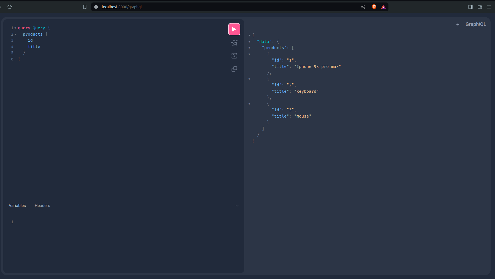
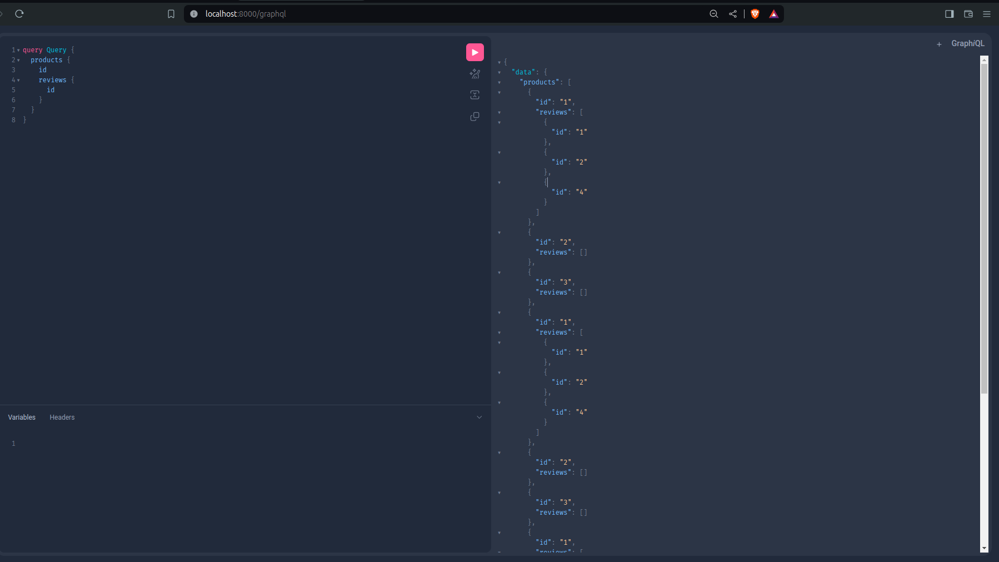
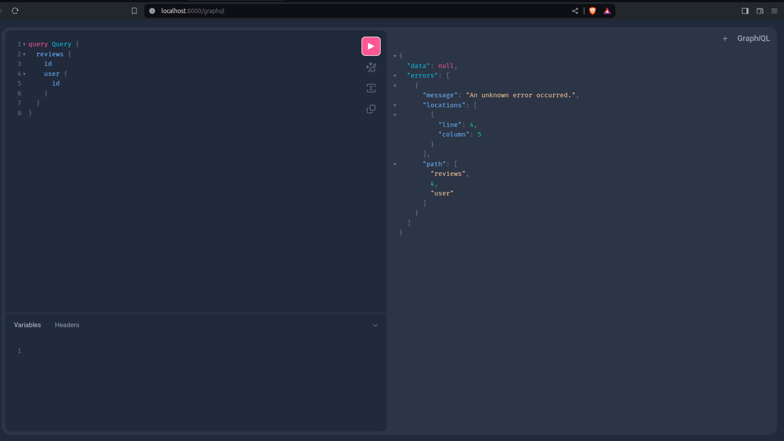
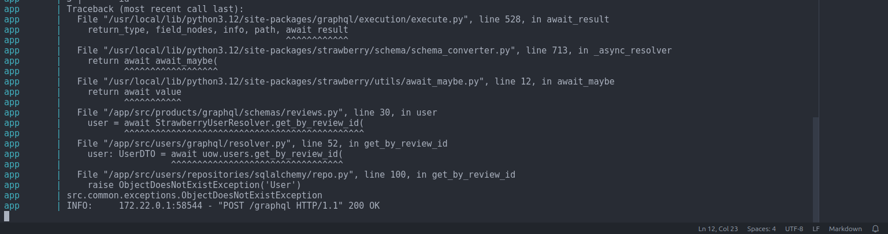
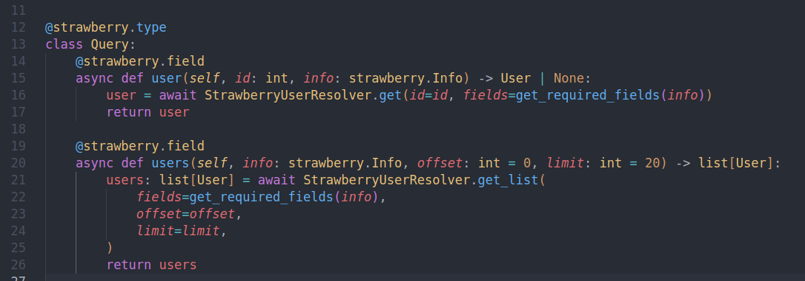

## Strawberry repeats nested queries, related to nested list object types

### Example

**If we will query simple list query, the problem does not appear:**

**But if we try to add nested query Strawberry starts to repeat them:**

**One more interesting thing, that when we want to execute nested query with 'users' we will get the Repository error:**

**I think that this problem also related to the repeated Strawberry queries, but i dont exclude that this problem is related to the UserRepository because of its different from the others.**

## Solution

__Now solution for this problem is not found, but the easiest way to party solve it is to make Query class to return interfaces of the object types and their implementation in list fields.__

**Example**
Instead of returning __list[User]__ Query can return __list[IUser]__

